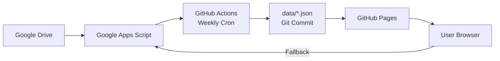

# 001 - 프로젝트 분석 및 요구사항 정리

**작업일**: 2026-03-03
**작업 유형**: 프로젝트 분석 / 요구사항 도출
**상태**: 완료

---

## 사용된 프롬프트

```
자 현재 웹페이지가 있어, 나는 이 페이지의 디자인을 조금더 잘 하고 싶고, 특히 앨범과, 주보에 대해서
블로그 형태의 특정 아이디를 가진 사람 만 업데이트를 하게 하고 싶어, 현재 공동체 소식에 구글 드라이브와
연동 해서 일종의 게시판 기능을 만들어 놓았는데 이 기능을 워드프레스나 railway 같은 곳을 통해서
서비스를 제공 하고 싶은데, 일단 구축해 놓으면 최대한 손을 안대고 싶어...
(중략 - 전체 프롬프트는 대화 이력 참조)
```

---

## 1. 현재 프로젝트 현황 분석

### 1.1 기술 스택
| 항목 | 상세 |
|------|------|
| Frontend | Pure HTML5 + Inline CSS + Vanilla JS |
| Hosting | GitHub Pages (정적 배포) |
| Data Backend | Google Apps Script (GAS) → Google Drive |
| CI/CD | GitHub Actions (주간 cron) |
| Font | Noto Sans KR (Google Fonts) |
| Icons | Font Awesome 6.0 (CDN) |

### 1.2 파일 구조
```
ctkorean/
├── index.html          (34KB - 메인 페이지)
├── news.html           (25KB - 공동체 소식)
├── data/
│   ├── announcements.json  (공지사항 4건)
│   ├── bulletins.json      (주보 1건)
│   └── albums.json         (앨범 9건)
├── tools/
│   └── publish-data.js     (GAS fetch 스크립트)
├── .github/workflows/
│   └── publish-data.yaml   (주간 자동 발행)
└── *.jpg, *.webp, *.png    (이미지 자산)
```

### 1.3 현재 데이터 흐름



### 1.4 현재 기능 목록
1. **메인 페이지** (index.html)
   - 히어로 이미지 슬라이더 (3장, 3초 자동 전환)
   - 성당 소개
   - 사제단 소개 (카드 그리드)
   - 미사 및 성사 안내 (9개 카드)
   - 긴급 공지 배너
   - 오시는 길 (Google Maps 임베드)
   - 공동체 소식 바로가기

2. **공동체 소식** (news.html)
   - 공지사항 (테이블 + 페이지네이션 + 펼침)
   - 주보 (테이블 + PDF 링크)
   - 앨범 (테이블 + 비밀번호 보호 + 썸네일)

---

## 2. 현재 문제점 분석

### 2.1 데이터 업데이트 지연
- **문제**: GitHub Actions가 주 1회(월요일 09:00 UTC)만 실행
- **영향**: Google Drive에 업데이트해도 최대 7일 지연
- **원인**: DB 없이 정적 JSON 커밋 방식

### 2.2 디자인 한계
- **문제**: 인라인 CSS로 유지보수 어려움, 현대적 디자인 트렌드 미반영
- **영향**: 단조로운 UI, 제한적 인터랙션
- **세부**: 하드코딩된 스타일, CSS 변수 미사용, 다크모드 미지원

### 2.3 Google Drive 링크 노출
- **문제**: JSON에 Google Drive 직접 URL 포함
- **영향**: 보안 우려, 링크 직접 접근 가능

### 2.4 다국어 미지원
- **문제**: 한국어만 지원, 영문 전환 없음
- **영향**: 영어 사용자 접근 불가

### 2.5 CMS 부재
- **문제**: 콘텐츠 업데이트를 위해 Google Sheets/Drive 직접 편집 필요
- **영향**: 비기술 사용자의 콘텐츠 관리 어려움

---

## 3. 요구사항 정리

### 3.1 기능 요구사항
| # | 요구사항 | 우선순위 | 비고 |
|---|----------|----------|------|
| F1 | Google Drive 변경 시 자동 웹사이트 반영 | 높음 | 실시간 또는 준실시간 |
| F2 | 앨범/주보 블로그형 표시 | 높음 | 카드/갤러리 레이아웃 |
| F3 | 특정 사용자만 콘텐츠 업데이트 가능 | 중간 | 패스워드 불필요 가능 |
| F4 | 한국어/영어 전환 | 중간 | 사용자 선택 가능 |
| F5 | Google Drive 직접 링크 비노출 | 높음 | 프록시 또는 임베드 |
| F6 | 반응형 디자인 (모바일/태블릿/데스크톱) | 높음 | 기존 유지 강화 |

### 3.2 비기능 요구사항
| # | 요구사항 | 상세 |
|---|----------|------|
| NF1 | 최소 유지보수 | 구축 후 손 안대기 |
| NF2 | 예산 | 월 ~$20 이내 |
| NF3 | 호스팅 안정성 | 소규모 트래픽 (소수 사용자) |
| NF4 | 모던 디자인 | 세련된 UI/UX |
| NF5 | 전체를 다 새로 개발하지 않음 | 기존 자산 활용 |

### 3.3 제약사항
- 기존 Google Drive/GAS 인프라 활용 선호
- 소규모 커뮤니티 (트래픽 적음)
- 비기술 사용자도 콘텐츠 업데이트 가능해야 함

---

## 4. 생성물

### 4.1 생성된 파일
- `CLAUDE.md` - 프로젝트 컨벤션 및 기술 스택 문서
- `documents/completed/001-project-analysis-and-requirements.md` - 이 문서

### 4.2 생성된 TODO
1. ~~현재 프로젝트 구조 및 아키텍처 분석~~ (완료)
2. Google Drive 실시간 동기화 방안 설계
3. 호스팅 플랫폼 비교 분석 및 추천
4. 디자인 모더나이제이션 방안 수립
5. 앨범/주보 블로그형 CMS 방안 설계
6. 다국어(한/영) 지원 아키텍처 설계
7. 전체 아키텍처 종합 및 구현 로드맵 작성

---

## 5. AI 대화 요약

### 수행 작업
1. 프로젝트 구조 전체 탐색 (Explore 에이전트 2개 병렬 실행)
2. 핵심 파일 직접 분석 (index.html, news.html, publish-data.js, workflow YAML)
3. 데이터 파일 구조 확인 (JSON 3종)
4. CLAUDE.md 작성
5. documents/completed 디렉토리 생성
6. TODO 7개 항목 생성
7. 분석 완료 문서 작성

### 핵심 발견사항
- 프레임워크 없는 순수 정적 사이트 (빌드 프로세스 없음)
- Google Drive ↔ GAS ↔ GitHub Actions 파이프라인 구축됨
- 주간 cron으로 인한 최대 7일 데이터 지연 문제
- 디자인은 기능적이나 모던함 부족
- i18n 완전 미구현
- 앨범 비밀번호 보호는 GAS 서버사이드로 처리
- 공지사항에 urgent 플래그로 긴급 공지 구분

### 다음 단계
- Task #2~#7의 각 분석 영역별 심층 조사 및 방안 수립
- 사용자와 각 방안에 대해 논의 및 확정
