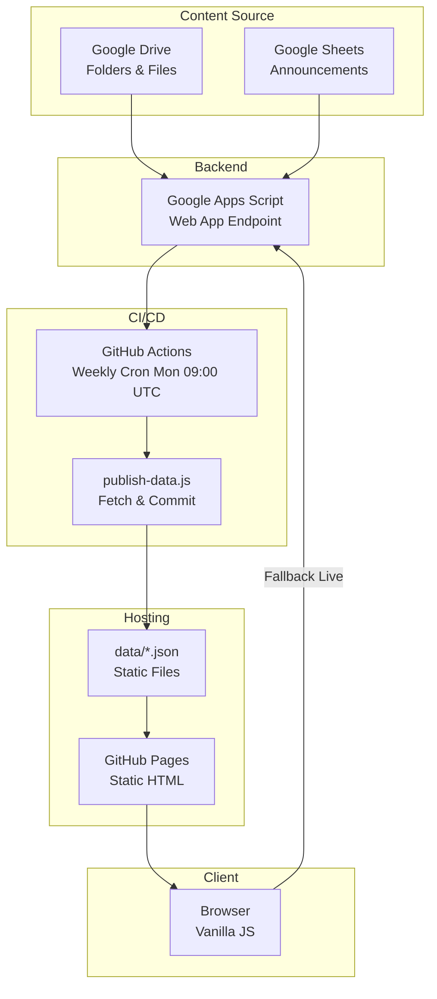
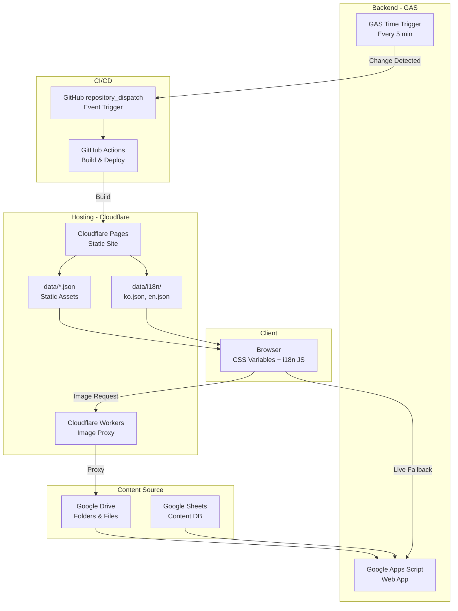
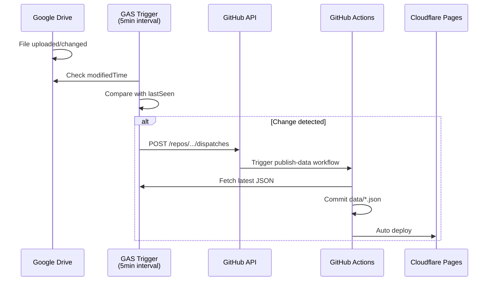
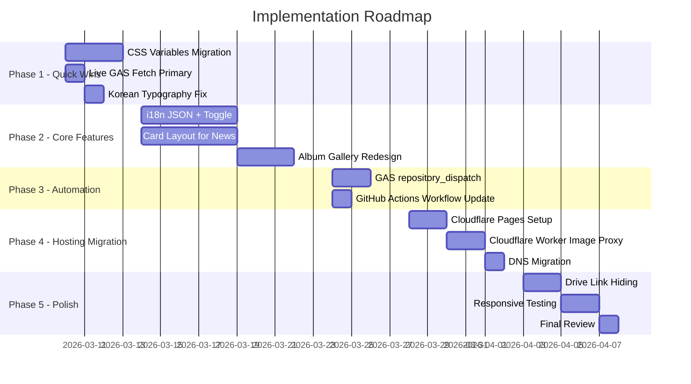

# 002 - 종합 아키텍처 분석 및 구현 로드맵

**작업일**: 2026-03-03
**작업 유형**: 아키텍처 분석 / 방안 수립 / 로드맵
**상태**: 완료

---

## 사용된 프롬프트

동일 세션 내 연속 작업. Task #2~#7 병렬 분석 수행.

---

## 1. 현재 아키텍처 vs 목표 아키텍처

### 1.1 현재 아키텍처 (AS-IS)



**문제점**:
- 주간 cron → 최대 7일 데이터 지연
- Google Drive URL 직접 노출
- 한국어만 지원
- 인라인 CSS → 유지보수 어려움
- CMS UI 부재 (Google Sheets 직접 편집)

### 1.2 목표 아키텍처 (TO-BE) - 추천안



---

## 2. 호스팅 플랫폼 비교 결과

| Platform | 가격 | 대역폭 | Edge Functions | CMS | 추천도 |
|----------|------|--------|----------------|-----|--------|
| **Cloudflare Pages** | **무료** | **무제한** | **Workers 10만req/day** | - | **1순위** |
| GitHub Pages | 무료 | 100GB soft | 없음 | - | 현행 유지 |
| Netlify | 무료 | 100GB | Edge 100만/mo | Decap CMS | 2순위 |
| Vercel | 무료* | 100GB | V8 100만/mo | - | 비추 (상업적 제한) |
| Railway | $5+/mo | 종량제 | - | - | 과도 (정적사이트에 불필요) |
| WordPress.com | $4~25/mo | 관리형 | - | Full WP | 비추 (개발자 통제력 상실) |
| Render | 무료 | 100GB | - | - | 장점 없음 |

### 추천: **Cloudflare Pages** (무료)
- 무제한 대역폭
- Workers로 Google Drive 이미지 프록시 가능 (10만 req/day 무료)
- GitHub 자동 배포
- 글로벌 CDN 300+ PoP → 한국/미국 모두 빠른 응답
- 현재 GitHub Pages 워크플로우와 동일한 Git push 방식

---

## 3. Google Drive 실시간 동기화 방안

### 추천: 3단계 계층 구조 (Layered Approach)

#### Layer A - 즉시 적용 (30분 소요, 무료)
**Live GAS 우선 fetch로 전환**
- 현재: Static JSON 먼저 → GAS fallback
- 변경: GAS 먼저 → Static JSON fallback
- 효과: 데이터 지연 0 (항상 최신)
- sessionStorage 캐시 5분 유지

#### Layer B - 준실시간 정적 갱신 (2~3시간 소요, 무료)
**GAS → GitHub repository_dispatch**
- GAS에 5분 주기 time-driven trigger 설치
- Google Drive 폴더 변경 감지
- 변경 시 GitHub `repository_dispatch` API 호출
- GitHub Actions 자동 실행 → JSON 갱신
- 지연 시간: 5~20분 (현재 7일 → 대폭 개선)



#### Layer C - 선택적 Edge 캐시 (GAS 성능 이슈 시)
**Cloudflare Worker KV 캐시**
- Worker가 GAS 응답 5분간 KV에 캐시
- GAS cold start 제거 (1~3초 → sub-100ms)
- 필요할 때만 구축

### 비교표

| 방안 | 복잡도 | 유지보수 | 비용 | 지연 |
|------|--------|---------|------|------|
| Layer A (Live 우선) | 매우 낮음 | 없음 | 무료 | 실시간 |
| Layer B (repository_dispatch) | 낮음 | 낮음 | 무료 | 5~20분 |
| Layer C (Worker KV) | 중간 | 낮음 | 무료 | 0~5분 |
| Drive API Watch | 높음 | 높음 | 낮음 | 30초~2분 |

---

## 4. 디자인 모더나이제이션 방안

### 4.1 CSS 접근법: Vanilla CSS + CSS Custom Properties
- Tailwind CDN은 **3.5MB** 로 성능 저하 → 비추
- CSS Custom Properties로 디자인 토큰 관리
- 빌드 프로세스 불필요, 현재 구조 유지

### 4.2 도입할 현대 CSS 기능

| 기능 | 지원 상태 | 추천 |
|------|----------|------|
| CSS Custom Properties | Baseline | 즉시 도입 |
| CSS Grid (현재 사용 중) | Baseline | 강화 |
| Container Queries | Baseline (2023~) | 카드 반응형에 활용 |
| View Transitions | 신규 (Firefox 144+) | 실험적 적용 |
| CSS Masonry | 미지원 (Chrome 140 테스트 중) | 사용 금지 |

### 4.3 디자인 개선 포인트
1. **카드 기반 레이아웃**: 주보/앨범을 테이블 → 카드 그리드로 변환
2. **앨범 갤러리**: CSS multi-column으로 masonry 효과 (JS 불필요)
3. **호버 애니메이션**: `transform: translateY(-4px)` + shadow transition
4. **한국어 타이포그래피**: `word-break: keep-all`, `letter-spacing: -0.02em`
5. **리터지컬 컬러 시스템**: CSS 변수로 계절별 색상 변경 가능

---

## 5. 앨범/주보 CMS 방안

### 추천: 현재 Google Sheets/Drive 유지 + 확장

**이유**: 이미 작동하는 시스템이 있고, 비기술 사용자에게 Google Sheets는 가장 친숙한 UI

**권한 관리**: Google Sheets 공유 설정으로 해결
- 특정 Google 계정만 편집 권한 부여
- 패스워드 불필요 (Google 계정 인증)

**대안 (필요 시)**:
- DecapCMS: GitHub 기반, `yoursite.com/admin/` 웹 폼 UI
- GitHub 계정으로 인증 (리포 collaborator)
- 현재 JSON 구조와 데이터 모델 변경 필요

### Google Drive 링크 비노출 방안

| 방안 | 복잡도 | 추천 |
|------|--------|------|
| `lh3.googleusercontent.com/d/FILE_ID=w400` | 없음 | 단기 |
| Cloudflare Worker 이미지 프록시 | 낮음 | 중기 |
| GitHub Actions에서 썸네일 다운로드 | 낮음 | 장기 |

---

## 6. 다국어(한/영) 지원

### 추천: `data-i18n` + JSON + Toggle Button

**구조**:
```
data/i18n/
├── ko.json    # 한국어 (기본)
└── en.json    # 영어
```

**장점**:
- HTML 파일 복제 불필요 (2페이지 유지)
- localStorage로 언어 설정 유지
- 한국어가 기본 하드코딩 → JS 로드 전에도 표시
- 30줄 바닐라 JS → 라이브러리 불필요

**비추 사유**:
- 별도 /en/, /ko/ 페이지: HTML 4개로 증가, 유지보수 2배
- i18next 라이브러리: 정적 2페이지에 과도

---

## 7. 구현 로드맵



### 단계별 요약

| Phase | 내용 | 소요 | 비용 | 우선순위 |
|-------|------|------|------|----------|
| 1 | CSS 변수화, Live GAS 우선, 타이포 | 3일 | 무료 | 즉시 |
| 2 | i18n, 카드 레이아웃, 앨범 갤러리 | 8일 | 무료 | 높음 |
| 3 | GAS → GitHub 자동 트리거 | 2일 | 무료 | 높음 |
| 4 | Cloudflare 마이그레이션 | 3일 | 무료 | 중간 |
| 5 | Drive 링크 은닉, 최종 테스트 | 3일 | 무료 | 중간 |

**총 비용: $0/월** (모든 서비스 무료 티어 활용)

---

## 8. 사용자 확인 필요 사항

아래 항목은 구현 전 사용자 확인이 필요합니다:

1. **호스팅**: Cloudflare Pages로 이전할 것인지, GitHub Pages 유지할 것인지?
2. **디자인 범위**: 전체 리디자인 vs 점진적 개선?
3. **CMS**: Google Sheets 유지 vs DecapCMS 도입?
4. **앨범 비밀번호**: 현재 비밀번호 보호를 유지할 것인지?
5. **커스텀 도메인**: 현재 사용 중인 도메인이 있는지?
6. **Google Drive 폴더 ID**: GAS trigger 구현 시 모니터링할 폴더 목록

---

## AI 대화 요약

### 수행 작업
- 3개 리서치 에이전트 병렬 실행 (호스팅, 동기화, 디자인/CMS/i18n)
- 7개 호스팅 플랫폼 가격/기능 비교 분석
- 5가지 Google Drive 동기화 방안 비교
- 현대 CSS/디자인 트렌드 조사
- i18n 4가지 접근법 비교
- CMS 4가지 옵션 비교 (GAS, DecapCMS, TinaCMS, Notion)
- 5단계 구현 로드맵 작성

### 핵심 결론
1. **호스팅**: Cloudflare Pages (무료, 무제한 대역폭, Workers 지원)
2. **동기화**: Layer A(Live GAS 우선) + Layer B(repository_dispatch) 조합
3. **디자인**: Vanilla CSS + Custom Properties (Tailwind CDN 비추)
4. **CMS**: 현재 Google Sheets 유지 + GAS 확장
5. **i18n**: data-i18n + JSON 파일 + 토글 버튼
6. **총 비용**: $0/월 (모든 무료 티어 활용 가능)
