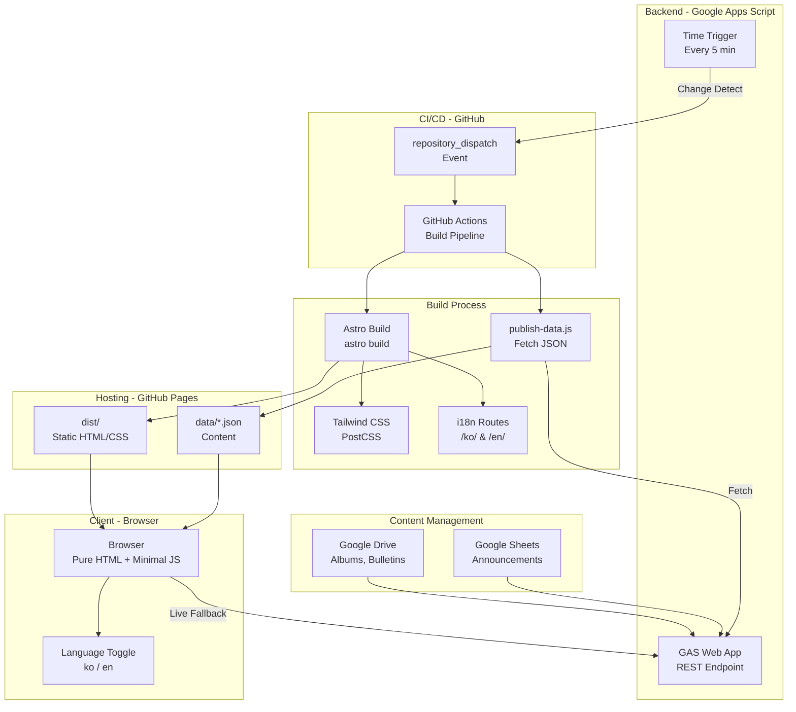
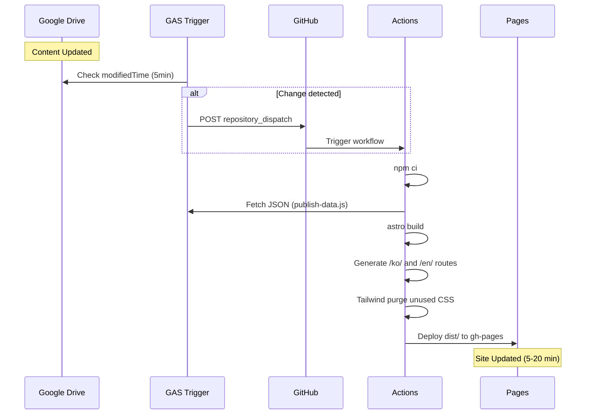
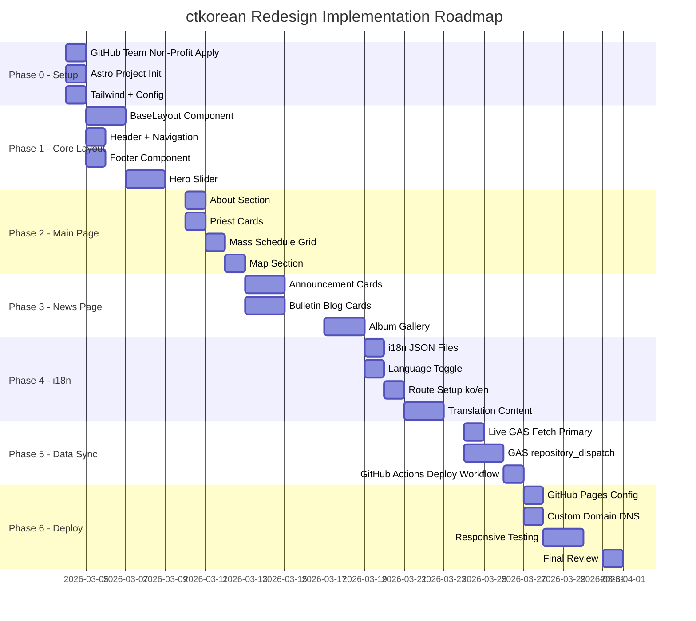

# 003 - 최종 아키텍처 확정 및 구현 로드맵

**작업일**: 2026-03-03
**작업 유형**: 아키텍처 확정 / 구현 로드맵
**상태**: 완료

---

## 사용된 프롬프트

연속 대화를 통한 의사결정 과정:
1. 초기 요구사항 분석 → 7개 호스팅 비교, 5개 동기화 방안, 디자인/CMS/i18n 분석
2. Non-profit 혜택 질문 → 4개 플랫폼 non-profit 프로그램 심층 조사
3. 프레임워크 비교 요청 → Pure HTML vs Astro vs Next.js vs 11ty 상세 비교
4. 최종 결정: Astro + Tailwind + GitHub Pages

---

## 1. 확정된 아키텍처 결정

| 항목 | 결정 | 이유 |
|------|------|------|
| 호스팅 | GitHub Pages + Team Non-Profit | 변경 최소, CI/CD 3000분 무료 확보 |
| 프레임워크 | Astro + Tailwind CSS | 컴포넌트 재사용, i18n 내장, JS 0KB 출력 |
| 디자인 | 전체 리디자인 | 모던 + 교회 + 프로페셔널 |
| i18n | Astro 내장 라우팅 (/ko/, /en/) | URL 기반, SEO 최적화 |
| 앨범 | 비밀번호 제거 | 구현 단순화 |
| CMS | Google Sheets 유지 (GAS 확장) | 교회 직원에게 가장 친숙 |
| 동기화 | Live GAS 우선 + repository_dispatch | 데이터 지연 0~20분 |
| 도메인 | 기존 커스텀 도메인 활용 | - |
| 비용 | $0/월 | 모든 무료 티어 활용 |

---

## 2. 최종 아키텍처 다이어그램

### 2.1 전체 시스템 아키텍처



### 2.2 빌드 파이프라인



### 2.3 프로젝트 구조 (새 Astro 프로젝트)

```
ctkorean/
├── src/
│   ├── components/
│   │   ├── Header.astro          # Navigation + Language Toggle
│   │   ├── Footer.astro          # Church Info + Copyright
│   │   ├── Hero.astro            # Image Slider
│   │   ├── PriestCard.astro      # Priest Info Card
│   │   ├── MassSchedule.astro    # Mass Schedule Grid
│   │   ├── BulletinCard.astro    # Weekly Bulletin Card
│   │   ├── AlbumGallery.astro    # Photo Album Grid
│   │   ├── AnnouncementList.astro # Announcements
│   │   ├── MapSection.astro      # Google Maps
│   │   └── LanguageToggle.astro  # KO/EN Switch
│   ├── layouts/
│   │   └── BaseLayout.astro      # HTML head, meta, shared layout
│   ├── pages/
│   │   ├── ko/
│   │   │   ├── index.astro       # Korean Main Page
│   │   │   └── news.astro        # Korean News Page
│   │   ├── en/
│   │   │   ├── index.astro       # English Main Page
│   │   │   └── news.astro        # English News Page
│   │   └── index.astro           # Root redirect to /ko/
│   ├── i18n/
│   │   ├── ko.json               # Korean Strings
│   │   └── en.json               # English Strings
│   ├── styles/
│   │   └── global.css            # Tailwind directives + custom
│   └── assets/
│       └── images/               # Hero, Priest photos
├── public/
│   └── data/                     # Static JSON (auto-generated)
│       ├── announcements.json
│       ├── bulletins.json
│       └── albums.json
├── tools/
│   └── publish-data.js           # GAS fetch script (기존 유지)
├── .github/workflows/
│   ├── deploy.yaml               # Astro build + deploy
│   └── publish-data.yaml         # Data sync (기존 확장)
├── astro.config.mjs
├── tailwind.config.mjs
├── package.json
├── CLAUDE.md
└── documents/completed/
```

---

## 3. 디자인 방향

### 3.1 디자인 키워드
- **모던**: 깔끔한 카드 UI, 넉넉한 여백, 세련된 타이포그래피
- **교회스러움**: 리터지컬 컬러, 십자가/성당 모티프, 경건한 분위기
- **프로페셔널**: 일관된 디자인 시스템, 반응형, 접근성

### 3.2 디자인 토큰 (Tailwind Custom Theme)

```javascript
// tailwind.config.mjs
export default {
  theme: {
    extend: {
      colors: {
        primary: {
          50:  '#EBF0FA',
          100: '#D7E1F5',
          200: '#AFCCEA',
          300: '#87A8D8',
          400: '#5F84C6',
          500: '#3A66B0',  // Main brand
          600: '#2E528D',
          700: '#233E6A',
          800: '#172A47',
          900: '#0C1624',
        },
        liturgical: {
          advent: '#5B2C6F',     // Purple
          christmas: '#FFFFFF',   // White
          lent: '#7D3C98',       // Purple
          easter: '#F4D03F',     // Gold
          ordinary: '#27AE60',   // Green
        }
      },
      fontFamily: {
        sans: ['Noto Sans KR', 'system-ui', 'sans-serif'],
      },
    },
  },
}
```

### 3.3 페이지 레이아웃 개요

**메인 페이지 (/ko/, /en/)**
```
+--------------------------------------------------+
| [Logo]  Nav: Home | News | Mass | About   [KO/EN] |
+--------------------------------------------------+
|                                                    |
|         Hero Image Slider (Full Width)             |
|    "Sacred Heart Korean Catholic Church"           |
|                  [CTA Buttons]                     |
|                                                    |
+--------------------------------------------------+
|                                                    |
|  About Our Parish          [Church Photo]          |
|  Brief description...                              |
|                                                    |
+--------------------------------------------------+
|                                                    |
|           Our Priests (Card Grid)                  |
|  [Card] [Card] [Card] [Card] [Card] [Card]       |
|                                                    |
+--------------------------------------------------+
|                                                    |
|         Mass & Sacrament Schedule                  |
|  [Card] [Card] [Card]                             |
|  [Card] [Card] [Card]                             |
|  [Card] [Card] [Card]                             |
|                                                    |
+--------------------------------------------------+
|                                                    |
|         Latest Bulletins (Card Carousel)           |
|  [Bulletin Card] [Bulletin Card] [Bulletin Card]  |
|                                                    |
+--------------------------------------------------+
|                                                    |
|         Photo Albums (Gallery Grid)                |
|  [Album] [Album] [Album] [Album]                  |
|                                                    |
+--------------------------------------------------+
|                                                    |
|         Directions & Map                           |
|  [Google Maps Embed]  Address + Phone              |
|                                                    |
+--------------------------------------------------+
|               Footer                               |
+--------------------------------------------------+
```

**뉴스 페이지 (/ko/news, /en/news)**
```
+--------------------------------------------------+
| [Logo]  Nav: Home | News | Mass | About   [KO/EN] |
+--------------------------------------------------+
|                                                    |
|  Announcements Section                             |
|  [Announcement Card] [Announcement Card]           |
|  [Announcement Card] [Announcement Card]           |
|  [Pagination]                                      |
|                                                    |
+--------------------------------------------------+
|                                                    |
|  Weekly Bulletins (Blog-style Cards)               |
|  [Date] [Title] [PDF Preview] [Download]           |
|  [Date] [Title] [PDF Preview] [Download]           |
|  [Pagination]                                      |
|                                                    |
+--------------------------------------------------+
|                                                    |
|  Photo Albums (Masonry Gallery)                    |
|  [Album] [Album] [Album]                          |
|  [Album]     [Album]                               |
|  [Pagination]                                      |
|                                                    |
+--------------------------------------------------+
|               Footer                               |
+--------------------------------------------------+
```

---

## 4. 구현 로드맵



### 단계별 상세

| Phase | 내용 | 산출물 | 비고 |
|-------|------|--------|------|
| 0 | 프로젝트 초기 설정 | Astro 프로젝트, Tailwind 설정 | 1일 |
| 1 | 핵심 레이아웃 | BaseLayout, Header, Footer, Hero | 3일 |
| 2 | 메인 페이지 컴포넌트 | About, Priest, Mass, Map | 3일 |
| 3 | 뉴스 페이지 컴포넌트 | Announcements, Bulletins, Albums | 4일 |
| 4 | 다국어 지원 | i18n JSON, Toggle, /ko/ /en/ 라우팅 | 4일 |
| 5 | 데이터 동기화 | Live GAS, repository_dispatch | 3일 |
| 6 | 배포 및 테스트 | GitHub Pages, DNS, 반응형 테스트 | 3일 |

**예상 총 소요: ~3주 (Phase 0~6)**

---

## 5. 즉시 실행 가능 항목 (Phase 0)

### 5.1 GitHub Team Non-Profit 신청
1. https://nonprofits.github.com/getting-started 방문
2. GitHub 조직 계정으로 인증
3. 501(c)(3) 상태 확인
4. Team 플랜 선택 (무료)

### 5.2 Astro 프로젝트 초기화
```bash
npm create astro@latest ctkorean-redesign -- --template minimal
cd ctkorean-redesign
npx astro add tailwind
```

### 5.3 GitHub Actions 배포 워크플로우
```yaml
# .github/workflows/deploy.yaml
name: Deploy to GitHub Pages
on:
  push:
    branches: [main]
  repository_dispatch:
    types: [gas-data-changed]
  workflow_dispatch:

permissions:
  contents: read
  pages: write
  id-token: write

jobs:
  build:
    runs-on: ubuntu-latest
    steps:
      - uses: actions/checkout@v4
      - uses: actions/setup-node@v4
        with:
          node-version: 20
      - run: npm ci
      - run: node tools/publish-data.js
      - run: npm run build
      - uses: actions/upload-pages-artifact@v3
        with:
          path: dist
  deploy:
    needs: build
    runs-on: ubuntu-latest
    environment:
      name: github-pages
      url: ${{ steps.deployment.outputs.page_url }}
    steps:
      - uses: actions/deploy-pages@v4
        id: deployment
```

---

## 6. Non-Profit 혜택 활성화 체크리스트

- [ ] GitHub Team Non-Profit 신청
- [ ] Google Cloud $10,000/년 크레딧 활성화 (firebase 등에 활용 가능)
- [ ] Google Ad Grants $10,000/월 활성화 (교회 홍보)
- [ ] Google Maps $250/월 크레딧 활성화

---

## AI 대화 요약

### 의사결정 과정
1. **호스팅**: 7개 플랫폼 비교 → Non-Profit 혜택 조사 → GitHub Pages 유지 + Team Non-Profit 확정
2. **프레임워크**: Pure HTML vs Astro vs Next.js vs 11ty → Astro + Tailwind 확정
3. **디자인**: 점진적 vs 전체 리디자인 → 전체 리디자인 확정
4. **앨범**: 비밀번호 유지 vs 제거 vs Google 인증 → 비밀번호 제거 확정
5. **동기화**: 5가지 방안 → Layer A + B 조합 확정

### 핵심 결론
- **총 비용: $0/월** (GitHub Pages 무료 + Non-Profit 혜택)
- **기술 스택: Astro + Tailwind CSS** (컴포넌트 재사용, i18n 내장, JS 0KB 출력)
- **데이터: Google Drive → GAS → GitHub Actions → Astro Build** (5~20분 지연)
- **디자인: 전체 리디자인** (모던 + 교회 + 프로페셔널)

### 다음 단계
Phase 0 실행: Astro 프로젝트 초기화 및 기본 설정
